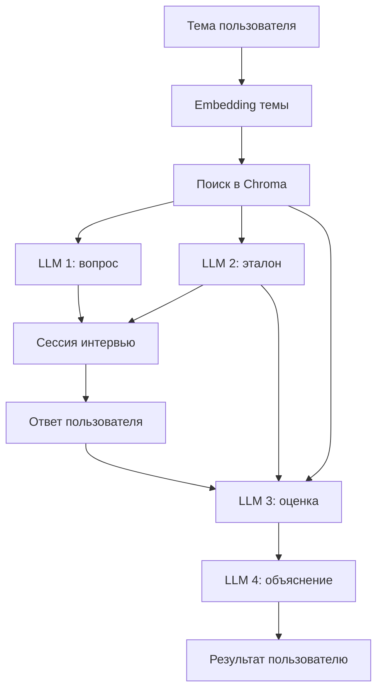

# ML Interview Coach

Локальный тренажёр технических интервью по машинному обучению. Пользователь выбирает тему, система находит релевантные фрагменты в его учебных материалах, формирует вопрос, принимает ответ и возвращает структурированную оценку вместе с понятной обратной связью.

Проект работает локально: генерация и эмбеддинги выполняются через Ollama, а векторный индекс хранится в Chroma.


## Возможности

- семантический поиск по пользовательским конспектам;
- генерация вопроса строго по выбранной теме и найденным материалам;
- отдельная генерация эталонного ответа и ключевых тезисов;
- оценивание ответа пользователя по шкале от 0 до 10;
- разделение фактических ошибок и пропущенных тезисов;
- отдельная генерация user-friendly обратной связи;
- FastAPI API и встроенный консольный клиент;
- локальная работа без отправки учебных материалов во внешние LLM API;
- хранение контекста интервью по `session_id` между двумя HTTP-запросами.

## Как работает система

В проекте используется один retrieval-запрос и четыре независимых генеративных вызова. Каждый вызов решает только одну задачу.



1. Тема преобразуется в embedding моделью `qwen3-embedding:0.6b`.
2. Chroma возвращает наиболее близкие фрагменты конспектов.
3. `qwen3.5:9b-q4_K_M` генерирует один вопрос.
4. Второй вызов модели создаёт эталонный ответ и ключевые тезисы.
5. Вопрос, эталон и найденные материалы сохраняются в памяти по `session_id`.
6. После ответа пользователя третий вызов выставляет структурированную оценку.
7. Четвёртый вызов преобразует техническую оценку в понятную обратную связь.

## Структура проекта

```text
ml_interview_coach/
├── data/                         # локальные конспекты в формате .txt
├── chroma_data/                  # локальный индекс Chroma
├── console_client.py             # консольный интерфейс
├── generate_feedback.py          # user-friendly обратная связь
├── generate_reference_answer.py  # эталонный ответ и key points
├── index_course.py               # индексация конспектов
├── main.py                       # FastAPI и точка входа
├── question_generation.py        # генерация вопроса
├── rag.py                        # embedding темы и retrieval
├── validate_answer.py            # структурированная оценка
└── requirements.txt
```

`data/` и `chroma_data/` не хранятся в Git. Добавляйте только материалы, которыми вы имеете право пользоваться и делиться.

## Технологии

- Python 3.11+
- FastAPI
- Pydantic 2
- Ollama
- Chroma
- LangChain Text Splitters
- Requests
- Uvicorn

## Локальные модели

По умолчанию используются:

| Назначение | Модель |
|---|---|
| Генерация и оценивание | `qwen3.5:9b-q4_K_M` |
| Эмбеддинги | `qwen3-embedding:0.6b` |

Установите Ollama, затем загрузите модели:

```powershell
ollama pull qwen3.5:9b-q4_K_M
ollama pull qwen3-embedding:0.6b
```

Проверить доступные модели:

```powershell
ollama list
```

Проверить модели, загруженные в память:

```powershell
ollama ps
```

## Установка

Клонируйте репозиторий:

```powershell
git clone https://github.com/STRG2026/ml_interview_coach.git
cd ml_interview_coach
```

Создайте и активируйте виртуальное окружение:

```powershell
python -m venv .venv
.venv\Scripts\Activate.ps1
```

Установите зависимости:

```powershell
python -m pip install --upgrade pip
pip install -r requirements.txt
```

## Подготовка материалов

Создайте директорию `data` и положите в неё текстовые конспекты:

```text
data/
├── 001_machine_learning_intro.txt
├── 002_ml_problem_statement.txt
└── 003_overfitting.txt
```

Рекомендуемый формат имени:

```text
<lesson_id>_<short_lesson_name>.txt
```

Постройте индекс:

```powershell
python index_course.py
```

Индексатор:

- читает все `.txt`-файлы из `data/`;
- делит текст на пересекающиеся чанки;
- создаёт embeddings батчами;
- пересоздаёт коллекцию `course_lessons`;
- сохраняет документы, embeddings и метаданные в `chroma_data/`.

Повторно запускайте индексацию после изменения конспектов или параметров чанкинга.

## Запуск

Для запуска FastAPI и консольного клиента одной командой:

```powershell
python main.py
```

Для запуска только API:

```powershell
uvicorn main:app --reload
```

После запуска доступны:

- API: `http://127.0.0.1:8000`
- Swagger UI: `http://127.0.0.1:8000/docs`
- health check: `http://127.0.0.1:8000/health`

## API

### Начать интервью

```http
POST /start_interview
Content-Type: application/json
```

```json
{
  "topic": "Переобучение модели"
}
```

Пример ответа:

```json
{
  "status": "success",
  "session_id": "d774a838-b259-4ca6-a56e-a3a58d2e3210",
  "question": "Как проявляется переобучение модели?"
}
```

### Отправить ответ

```http
POST /user_answer
Content-Type: application/json
```

```json
{
  "session_id": "d774a838-b259-4ca6-a56e-a3a58d2e3210",
  "answer": "Ошибка на обучающей выборке мала, а на тестовой заметно больше."
}
```

Ответ содержит:

- `evaluation` — оценку, правильные тезисы, ошибки и пропуски;
- `reference_answer` — эталонный ответ;
- `final_feedback` — понятное объяснение результата.

## Основные модели данных

### `Material`

Один найденный RAG-фрагмент:

- текст документа;
- метаданные источника;
- cosine distance до пользовательской темы.

### `ReferenceAnswer`

- связный эталонный ответ;
- список обязательных ключевых тезисов.

### `EvaluationResult`

- `score` от 0 до 10;
- `verdict`;
- корректные тезисы пользователя;
- фактические ошибки;
- пропущенные важные тезисы;
- техническое резюме оценки.

## Принятые архитектурные решения

- Вопрос, эталон, оценка и финальный feedback генерируются отдельно, чтобы не смешивать зоны ответственности.
- `verdict` вычисляется в Python на основе `score`, поэтому модель не может вернуть противоречивую комбинацию.
- Pydantic-схемы используются для проверки структурированных ответов модели.
- Найденные RAG-материалы сохраняются в сессии и повторно не извлекаются при оценивании.
- Доступ к локальной LLM сериализован через `Lock`, чтобы параллельные запросы не перегружали ограниченную GPU-память.
- Chroma хранится локально и пересоздаётся отдельным индексатором.

## Текущие ограничения

- сессии хранятся только в памяти процесса и теряются при перезапуске;
- модель и параметры генерации пока задаются непосредственно в коде;
- качество retrieval зависит от размера чанков и состава конспектов;
- локальный inference может занимать заметное время на GPU с небольшим объёмом VRAM;
- проект пока не содержит автоматических тестов и CI;
- приложение рассчитано на локальный однопользовательский сценарий.

## Ближайший roadmap

- [ ] вынести настройки моделей и путей в конфигурацию;
- [ ] добавить `.env.example`;
- [ ] добавить порог релевантности retrieval;
- [ ] покрыть основную логику unit-тестами с mock-объектами;
- [ ] добавить end-to-end smoke test;
- [ ] добавить GitHub Actions для lint и тестов;
- [ ] зафиксировать версии зависимостей;
- [ ] добавить небольшой легально распространяемый пример данных;
- [ ] измерять длительность каждого этапа pipeline;
- [ ] рассмотреть Docker после стабилизации локального запуска.

## Статус

Проект находится на стадии локального MVP. Основной end-to-end сценарий реализован, но перед использованием как стабильного приложения необходимо завершить обработку ошибок, добавить тесты и проверить воспроизводимый запуск на чистом окружении.
